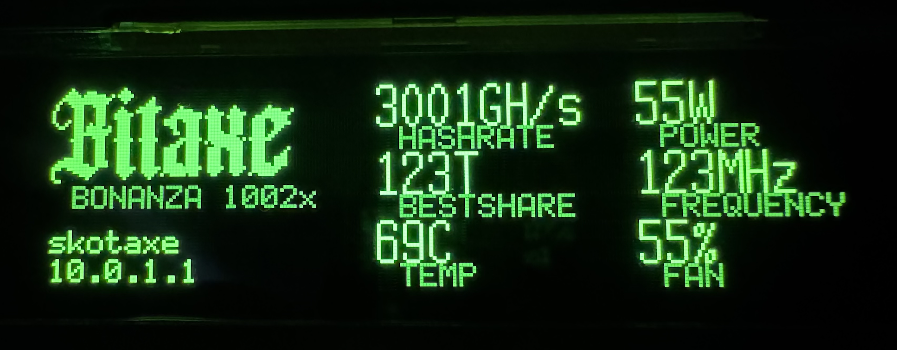

# bonanzaDisplay-fw


Firmware for driving a **SSD1322-based 256×64 OLED display** from a **RP2350** on the bitaxeBonanza display board using the **LVGL** graphics library.

The `ui` directory is an **LVGL Editor / LVGL Pro project**. Its XML files are
the source of truth for screen layout, styles, fonts, and data bindings; the
exported C is compiled directly into the Pico firmware.

The display is connected through an **8080 8-bit parallel interface**. The CPU
packs LVGL's L8 framebuffer into the SSD1322's 4bpp format, then DMA and PIO
perform the hardware-timed transfer.

## Features

- **SSD1322 256×64 OLED** — 4-bit grayscale (16 shades)
- **8080 parallel bus** via PIO hardware — ~2.9 MHz byte rate
- **DMA + PIO** transfer the packed framebuffer with no CPU-driven bus writes
- **LVGL 9.x** rendering — L8 (8bpp) with automatic 4bpp packing
- **Double-buffered** full-screen render mode
- **Px437 FMTowns and Portfolio** 1bpp bitmap fonts shared with `bitaxe-lcd`
- **Bitaxe-style dashboard** with an L8 logo and subject-bound mining metrics

## Hardware

### Components

The [bonanzaDisplay](https://github.com/bitaxeorg/bonanzaDisplay) v2 hardware is attached to the [bitaxeBonanza-1002x](https://github.com/bitaxeorg/bitaxeBonanza/tree/1002x) via a 10 pin FPC that delivers 12VDC power, I2C and GPIO. The bonanzaDisplay is controlled by a RP2350 microcontroller.

### Wiring — RP2350 to SSD1322 Display

| RP2350 | GPIO   | Signal | Display Pin | Description |
|------- |--------|--------|-------------|-------------|
| Pin 2  | GPIO0  | D0     | 13 (D0)     | Data bit 0 |
| Pin 3  | GPIO1  | D1     | 12 (D1)     | Data bit 1 |
| Pin 4  | GPIO2  | D2     | 11 (D2)     | Data bit 2 |
| Pin 5  | GPIO3  | D3     | 10 (D3)     | Data bit 3 |
| Pin 7  | GPIO4  | D4     | 9 (D4)      | Data bit 4 |
| Pin 8  | GPIO5  | D5     | 8 (D5)      | Data bit 5 |
| Pin 9  | GPIO6  | D6     | 7 (D6)      | Data bit 6 |
| Pin 10 | GPIO7  | D7     | 6 (D7)      | Data bit 7 |
| Pin 12 | GPIO8  | RES#   | 20 (RES#)   | Reset (active low) |
| Pin 13 | GPIO9  | CS#    | 19 (CS#)    | Chip select (active low) |
| Pin 14 | GPIO10 | DC#    | 18 (D/C#)   | Data/Command select |
| Pin 15 | GPIO11 | R/W#   | 15 (R/W#)   | Write strobe (active low) |
| Pin 16 | GPIO12 | E/RD#  | 14 (E/RD#)  | Read strobe (active low) |

> **Note:** The display is configured for **8080 parallel mode**

### Dial Switch
The bonanzaDisplay has a SIQ-02FVS3 push-button jog wheel on it for interacting with the display. It is connected to the RP2350:

| Dial Switch Pin  | Function     | RP2350 | GPIO   |
|------------------|--------------|--------|--------|
| Counterclockwise | Quadrature A | Pin 19 | GPIO15 |
| Clockwise        | Quadrature B | Pin 17 | GPIO13 |
| Switch           | Push switch  | Pin 18 | GPIO14 |

The Counterclockwise and Clockwise pins are active-low quadrature phases. Both phase pins use pull-ups and connect to COM/GND through the dial contacts as the wheel rotates. Direction is decoded from the A/B phase sequence across a full detent. The Switch pin is also active-low and connects to COM/GND while the dial is pressed.

## bonanzaDisplay control interface
The bonanzaDisplay is a 100 kHz I2C slave and is designed to receive all of
the screen metrics from a connected bitaxe. Its 7-bit slave address is
**`0x3C`**. The bus controller supplies the clock; configure it for no more
than 100 kHz. The firmware enables the RP2350's weak internal pull-ups, but the
finished hardware should also provide normal external I2C pull-up resistors.

### Pinout
| Signal  | RP2350 pin name     |
|---------|---------------------|
| SDA     | GPIO20              |
| SCL     | GPIO21              |
| GPIO1   | GPIO22              |
| GPIO2   | GPIO23              |

GPIO22 and GPIO23 are reserved for future control signals and are not used by
this firmware.

### I2C register protocol

Each transaction starts with a one-byte register address. Bytes written after
that address are stored in consecutive registers; reads return consecutive
registers from the current address. To read, first write the desired register
address and then issue a repeated-start read. Register addressing wraps at
`0x7F`.

Strings are fixed-size, NUL-terminated ASCII fields. A write beginning at a
string's base register clears that whole field first, so the controller may
send only the new text and its terminating NUL. Numbers are unsigned 32-bit
little-endian values. Registers `0x00` through `0x0F` are read-only.

| Register | Size | Access | Value |
|----------|-----:|:------:|-------|
| `0x00` | 1 | R | Protocol version (`1`) |
| `0x01` | 1 | R | I2C address (`0x3C`) |
| `0x02` | 1 | R | Register-file size (`128`) |
| `0x10` | 16 | R/W | Device family, e.g. `BONANZA` |
| `0x20` | 8 | R/W | Device model, e.g. `1002` |
| `0x28` | 16 | R/W | Device name, e.g. `battleaxe` |
| `0x38` | 16 | R/W | IPv4 address string |
| `0x48` | 16 | R/W | Best-share string, e.g. `123T` |
| `0x60` | 4 | R/W | Hashrate in GH/s |
| `0x64` | 4 | R/W | Temperature in degrees C |
| `0x68` | 4 | R/W | Power in watts |
| `0x6C` | 4 | R/W | Hash frequency in MHz |
| `0x70` | 4 | R/W | Fan speed in percent |

The UI is updated after the I2C transaction finishes. For example, the byte
sequence `60 B0 04 00 00` written to address `0x3C` sets the hashrate to
1200 GH/s. The byte sequence `48 31 32 33 54 00` sets best share to `123T`.

### Metrics
- device name. [string] ex: PROTO, GAMMA, BONANZA
- device model number. [string] ex: 1102, 600, 1002
- device name. [string] ex: battleaxe
- Bitaxe IP address. [string] ex: 192.168.1.234
- current hashrate. [number] ex: 1200 (shown with GH/s units)
- current best share. [string] ex: 123T
- current temp. [number] ex: 58 (shown with C units)
- current power. [number] ex: 17 (shown with W units)
- current hash frequency. [number] ex: 621 (shown with MHz units)
- current fan speed. [number] ex: 66 (shown with %)

## Building

### Prerequisites

- [Pico SDK 2.x](https://github.com/raspberrypi/pico-sdk) installed at `~/pico-sdk` (or set `PICO_SDK_PATH`)
- `arm-none-eabi-gcc` toolchain
- `cmake` and a supported build backend such as Make or Ninja
- [picotool](https://github.com/raspberrypi/picotool) for flashing

### Build

```bash
export PICO_SDK_PATH=/path/to/pico-sdk
cmake -S . -B build -DPICO_BOARD=pico2_w
cmake --build build -j
```

### Flash

```bash
picotool load build/bonanzaDisplay.uf2 -f && picotool reboot
```

Or hold BOOTSEL while connecting USB, then drag `build/bonanzaDisplay.uf2` to the mounted drive.

## Edit the UI with LVGL Editor

1. Install LVGL Editor or the official VS Code extension. The project is known
   to work with extension 1.0.1; using the latest available version is
   recommended.
2. Open `bonanzaDisplay-fw.code-workspace`. Its first workspace folder is
   `ui`, which puts `globals.xml` and `project.xml` at the root expected by the
   editor. Opening the `ui` directory by itself also works.
3. If the extension was already running, use **Developer: Reload Window** once.
4. Open LVGL Editor and select the `pico2w_ssd1322` target. The preview is
   configured for the physical **256×64 L8 grayscale** display.
5. Edit `ui/screens/main_screen.xml` in Design or XML mode.
6. Choose **Compile and export code**, then rebuild the firmware.

Keep the `ui/fonts` and `ui/images` directories present. LVGL Editor's
containerized resource converter mounts both directories. The images directory
contains the Bitaxe logo source PNG and its generated L8 C data.

The UI uses the same Px437 FMTowns 8×16 and Portfolio 6×8 fonts as
`bitaxe-lcd`. With LVGL Editor 1.0.x, asset filenames must not contain spaces
because its resource-converter command does not quote font paths.

Files ending in `_gen.c` or `_gen.h`, plus `file_list_gen.cmake`, are owned by
LVGL Editor and may be overwritten. Put persistent C code in `bonanza_ui.c`,
`bonanza_ui.h`, or add extra sources in `user_config.cmake`.

The dashboard is adapted from `bitaxe-lcd` for the 256×64 OLED. It displays the
Bitaxe logo, device identity, IP address, hashrate, best share, temperature,
power, frequency, and fan speed.

The XML binds all visible metrics to LVGL subjects. Application code can update
them together with `bonanza_ui_set_metrics()`. In normal operation, the main
loop calls this after receiving a complete I2C write transaction. Individual
integer subjects can also be changed directly, for example:

```c
lv_subject_set_int(&hashrate_ghs, 1200);
lv_subject_set_int(&asic_temp_c, 58);
lv_subject_set_int(&power_w, 17);
```

The firmware also updates dial-switch subjects through
`bonanza_ui_set_dial_state()`, although the current dashboard does not display
them. Keep all LVGL calls on the same core/thread as `lv_timer_handler()` unless
synchronization is added.

### Preview troubleshooting

- LVGL Editor 1.0.x does not quote resource paths correctly, so font and image
  filenames must not contain spaces.
- If the preview refers to an asset that has been removed or renamed, close the
  preview, remove `ui/preview-bin` and `ui/preview-build`, then click the hammer
  to build a fresh runtime. These directories are generated and ignored by Git.
- Screen zoom is not persisted by LVGL Editor 1.0.1. A persistent `<preview
  zoom="200%">` is supported for components and widgets, but not screens. VS
  Code's `window.zoomLevel` can enlarge the whole editor as a workaround.

## Project Structure

```
bonanzaDisplay/
├── .gitignore                  # Build, firmware, and editor-cache exclusions
├── bonanzaDisplay-fw.code-workspace # Opens UI at the LVGL Editor project root
├── CMakeLists.txt              # Top-level build configuration
├── config/
│   ├── lv_conf.h               # LVGL configuration
│   └── pin_config.h            # GPIO pin assignments
├── src/
│   ├── main.c                  # Entry point, hardware init, and live UI data
│   ├── control/
│   │   ├── i2c_control.c       # I2C slave register file and IRQ handler
│   │   └── i2c_control.h       # Public register map and metrics snapshot
│   ├── display/
│   │   ├── ssd1322.c           # SSD1322 driver (PIO + DMA + bitbang)
│   │   ├── ssd1322.h           # Driver public API
│   │   ├── ssd1322_regs.h      # Register definitions and geometry
│   │   └── parallel_8080.pio   # PIO program for 8080 bus
│   ├── fonts/
│   │   └── lv_font_portfolio_6x8.c # LVGL default/fallback font
│   ├── input/
│   │   ├── dial_switch.c       # Jog-wheel decoding and debounce
│   │   └── dial_switch.h
│   ├── lvgl_port/
│   │   ├── lv_port_disp.c      # LVGL display driver (L8 → 4bpp → DMA)
│   │   └── lv_port_disp.h
├── ui/                         # LVGL Editor / LVGL Pro project
│   ├── project.xml             # 256×64 L8 target definition
│   ├── globals.xml             # Fonts, logo, and observable subjects
│   ├── fonts/                  # Source TTFs and editor-generated font data
│   ├── images/
│   │   ├── bitaxe_logo.png     # Editable logo source
│   │   └── bitaxe_logo_data.c  # Editor-generated L8 image data
│   ├── screens/
│   │   ├── main_screen.xml     # Editable screen source
│   │   └── main_screen_gen.c   # Editor-generated firmware source
│   ├── bonanza_ui.c            # Persistent application-facing UI hooks
│   ├── bonanza_ui_gen.c        # Editor-generated subjects/assets setup
│   ├── file_list_gen.cmake     # Editor-generated source manifest
│   ├── user_config.cmake       # Persistent extra-source configuration
│   └── CMakeLists.txt          # Builds exported UI as lib-ui
└── lib/
    └── lvgl/                   # LVGL 9.x (git submodule)
```

## Architecture

```
┌─────────────┐    ┌──────────────┐    ┌───────────┐    ┌──────────┐
│  LVGL 9.x   │───►│ L8 → 4bpp    │───►│    DMA    │───►│   PIO    │
│  (render)   │    │  (packing)   │    │ (transfer)│    │ (8080)   │
└─────────────┘    └──────────────┘    └───────────┘    └────┬─────┘
                                                             │ 8-bit
                                                             ▼ parallel
                                                        ┌──────────┐
                                                        │ SSD1322  │
                                                        │  OLED    │
                                                        └──────────┘
```

1. **LVGL Editor** exports the XML UI as C, and LVGL renders it to an L8
   (8-bit luminance) double buffer.
2. The CPU-side **flush callback** packs L8 → 4bpp by taking each pixel's upper
   nibble and combining two adjacent pixels per byte.
3. **DMA** transfers the packed buffer to the PIO TX FIFO without CPU-driven
   bus writes.
4. **PIO** clocks out each byte with hardware-timed WR# strobes on the 8080 bus

## Grayscale and brightness

The OLED emits a single color but supports **16 brightness levels per pixel**.
LVGL renders 8-bit luminance and the flush callback reduces it to the SSD1322's
4-bit grayscale range. For predictable UI brightness, use neutral RGB values
with equal components:

```xml
text_color="0xffffff"  <!-- level 15: brightest -->
text_color="0xaaaaaa"  <!-- level 10 -->
text_color="0x777777"  <!-- level 7 -->
text_color="0x333333"  <!-- level 3 -->
text_color="0x000000"  <!-- level 0: off -->
```

Values from `0x000000`, `0x111111`, ... through `0xffffff` map naturally to
the 16 hardware levels. Colored preview values have no hue on the OLED; LVGL
converts them to luminance. The Bitaxe logo is converted to L8 in `globals.xml`,
and its displayed brightness can be adjusted with an `image_recolor` style
using a neutral grayscale value.

## Fonts

The editable UI uses the same 1bpp Px437 FMTowns 8×16 and Portfolio 6×8
fonts as `bitaxe-lcd`. Their source `.ttf` files and editor-generated C data
live in `ui/fonts`.

## License

GPL v3 -- FOSS || GTFO
